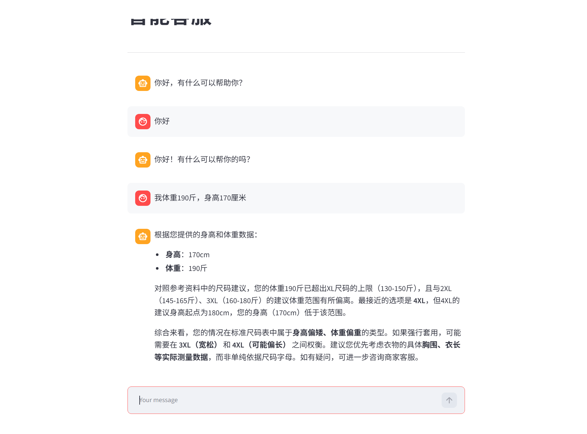
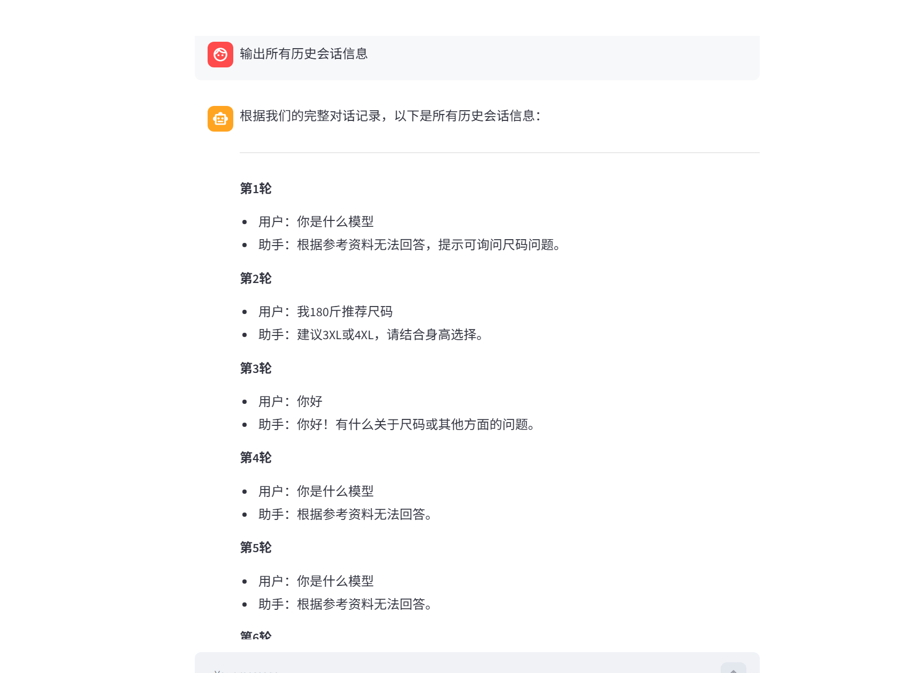
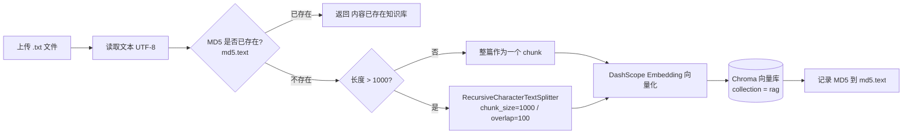
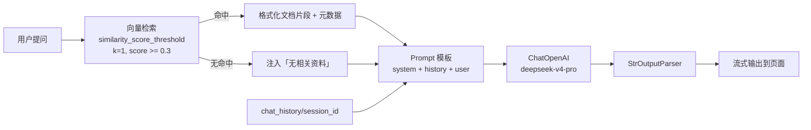

# 智能客服 RAG 知识库问答系统

基于 **LangChain + Chroma + Streamlit** 搭建的电商智能客服问答系统。系统把商品资料（尺码推荐、洗涤养护、颜色搭配等）切片向量化后存入本地 Chroma 向量库，用户提问时先检索相关资料，再由大模型结合资料与多轮对话历史生成回答。

采用「**有资料就依据资料回答，没资料就用通用知识兜底**」的策略，避免检索结果为空时模型拒答。

---

## 运行效果

### 一、检索增强问答：依据知识库给出尺码建议

用户直接输入身高体重，系统先检索知识库中的尺码对照表，再结合数据作答。这里能看出模型没有机械套用尺码表，而是指出了「身高 170cm / 体重 190 斤」落在标准尺码边缘时应当如何取舍：

> 参照参考资料中的尺码建议，您的体重 190 斤已超出 XL 尺码的上限（130-150 斤）……最接近的选项是 4XL，但 4XL 的建议身高起点为 180cm，您的身高（170cm）低于该范围。综合来看，您的情况在标准尺码表中属于身高偏矮、体重偏重的类型。



### 二、多轮对话记忆：可回溯完整会话

对话历史按 `session_id` 持久化到 `chat_history/`，不会随页面刷新丢失。因此可以直接追问「输出所有历史会话信息」，让助手复述之前的每一轮问答，用于验证记忆链路是否生效：



---

## 功能特性

| 能力 | 说明 |
| --- | --- |
| 知识库 Web 上传 | 通过 Streamlit 页面上传 `.txt` 文件，自动切分、向量化、入库 |
| MD5 内容去重 | 已入库内容二次上传会被识别并拒绝，避免向量库重复膨胀 |
| 向量检索增强 | 基于 Chroma 的相似度检索，支持相关性分数阈值过滤 |
| 无命中兜底 | 检索结果低于阈值时视为「无相关资料」，模型改用通用知识作答 |
| 多轮对话记忆 | 对话历史按 `session_id` 落盘为 JSON，重启服务后仍可续聊 |
| 流式输出 | 对话页逐字流式渲染，配合「AI 思考中」加载态 |

---

## 技术栈

- **Web 框架**：Streamlit（页面元素变化会重跑脚本，状态用 `st.session_state` 维护）
- **编排框架**：LangChain（LCEL 链式表达、`RunnableWithMessageHistory`）
- **向量库**：Chroma（本地持久化，无需额外部署）
- **嵌入模型**：阿里云 DashScope `text-embedding-v3`
- **对话模型**：通过 OpenAI 兼容接口调用（默认 `deepseek-v4-pro`）

---

## 系统架构

### 写入链路（知识入库）



### 查询链路（问答）



---

## 目录结构

```
Rag-project/
├── app.py                     # 【入口 1】智能客服对话页
├── app_file_upload.py         # 【入口 2】知识库上传页
├── rag.py                     # RAG 核心服务：检索 → Prompt → LLM 链
├── knowlege_base.py           # 知识库写入：MD5 去重 + 切分 + 入库
├── vector_stores.py           # 检索器封装（含相关性阈值过滤）
├── file_history_store.py      # 对话历史文件持久化
├── config_data.py             # 全局配置（模型、切分参数、路径、会话 ID）
├── requirements.txt           # 依赖清单（锁定版本）
├── 尺码推荐.txt               # 示例语料：身高体重 → 尺码对照
├── 洗涤养护.txt               # 示例语料：按季节/材质说明洗涤方式
├── 颜色选择.txt               # 示例语料：肤色/场合/体型选色建议
├── docs/
│   └── images/                # README 运行效果截图
├── md5.text                   # 已入库内容 MD5 记录（运行后自动生成）
├── chroma.db/                 # Chroma 向量库持久化目录（运行后自动生成）
└── chat_history/              # 对话历史 JSON（运行后自动生成）
```

> 仓库中已提供三份服装类示例语料，可直接上传体验效果。

---

## 快速开始

### 1. 环境准备

Python 3.11+（开发环境使用 3.11.9）。

```bash
python -m venv .venv

# Windows
.venv\Scripts\activate
# macOS / Linux
source .venv/bin/activate

pip install -r requirements.txt
```

### 2. 配置 API Key

项目**不包含任何密钥**，必须通过环境变量注入：

```bash
# 嵌入模型（DashScope）
export DASHSCOPE_API_KEY="sk-xxxxxxxx"

# 对话模型（OpenAI 兼容接口）
export OPENAI_API_KEY="sk-xxxxxxxx"
```

Windows PowerShell：

```powershell
$env:DASHSCOPE_API_KEY = "sk-xxxxxxxx"
$env:OPENAI_API_KEY = "sk-xxxxxxxx"
```

也可以把变量写进 `.env` 并在代码中加载，或直接在启动脚本里设置。

### 3. 启动服务

两个页面是**独立的 Streamlit 进程**，需要分别启动：

```bash
# 知识库上传页
streamlit run app_file_upload.py

# 智能客服对话页
streamlit run app.py
```

> 必须在**项目根目录**下启动。配置里的 `./chroma.db`、`./md5.text`、`./chat_history` 都是相对路径。

### 4. 使用流程

1. 打开上传页，上传 `尺码推荐.txt` / `洗涤养护.txt` / `颜色选择.txt`，看到「[成功]内容已存入知识库」即入库完成；
2. 打开对话页，提问例如「我身高 172，体重 130 斤，穿什么码？」「真丝裙子怎么洗？」；
3. 如需清空某会话历史，删除 `chat_history/<session_id>` 文件即可。

---

## 配置说明

所有可调参数集中在 `config_data.py`：

| 配置项 | 默认值 | 说明 |
| --- | --- | --- |
| `md5_path` | `./md5.text` | 已入库内容 MD5 记录文件 |
| `collection_name` | `"rag"` | Chroma 集合名 |
| `persist_directory` | `"./chroma.db"` | 向量库持久化目录 |
| `chunk_size` | `1000` | 文本切片最大长度 |
| `chunk_overlap` | `100` | 相邻切片重叠字符数 |
| `separators` | `["\n\n","\n",".","!","?","。","！","？"," ",""]` | 递归切分优先级 |
| `max_spliter_char_number` | `1000` | 小于该长度不切分，整篇入库 |
| `similarity_threshold` | `1` | **实际作为 `k` 使用**，即返回的文档条数 |
| `min_relevance_score` | `0.3` | 相关性最低分（0~1）。低于该分数的片段被过滤；设为 `None` 关闭过滤 |
| `embedding_model_name` | `"text-embedding-v3"` | 嵌入模型 |
| `chat_model_name` | `"deepseek-v4-pro"` | 对话模型 |
| `session_config` | `{"configurable": {"session_id": "user_001"}}` | 会话 ID，决定历史记录文件 |

**调参建议**：

- `min_relevance_score` 设太低（如 0.2）容易把无关片段塞进 Prompt，设太高（如 0.6）容易漏掉有效资料；不确定时可在 `0.3 ~ 0.5` 之间试。
- 想让回答覆盖更多资料，把 `similarity_threshold` 从 `1` 调大（例如 `3`）——注意这个变量名有歧义，它对应的是检索条数 `k`，不是分数阈值。

---

## 核心模块说明

### `rag.py` — RagService

RAG 主服务，构造时组装 LCEL 链：

```
{ input, content(检索结果) } → 组装 Prompt → LLM → 字符串输出
```

外面再套一层 `RunnableWithMessageHistory`，用 `input_messages_key="input"` 和 `history_messages_key="history"` 把历史消息注入 Prompt 的 `MessagesPlaceholder`。

System Prompt 明确了两条回答规则：**资料可用则依据资料作答；资料为空或不相关则用通用知识回答，并提示该回答并非来自当前资料。**

链中夹了一个 `print_prompt`，会把完整 Prompt 打印到控制台，便于调试检索命中情况。

### `knowlege_base.py` — KnowledgeBaseService

负责知识写入。要点：

- 用 `get_string_md5` 对原始文本取 MD5，`check_md5` 查 `md5.text` 做幂等判断；
- 文本长度超过 `max_spliter_char_number` 才走切分器，否则整篇入库；
- 每个 chunk 写入同一条元数据：`source`（文件名）、`create_time`（入库时间）、`operator`（固定为「客户」）。

### `vector_stores.py` — VectorStorService

检索器封装。当 `min_relevance_score` 不为 `None` 时，把 `search_type` 切成 `similarity_score_threshold` 并传入 `score_threshold` —— **只有指定这个 search_type，分数过滤才会真正生效**。

### `file_history_store.py` — FileChatMessageHistory

实现 `BaseChatMessageHistory`，把消息序列化到 `chat_history/<session_id>`。读取时用 `try/except` 同时捕获 `FileNotFoundError` 和 `json.JSONDecodeError`，所以历史文件为空或损坏时会安全返回空列表，而不是让整个应用崩溃。

### `app.py` / `app_file_upload.py` — Streamlit 页面

两个页面都遵守同一个原则：**把重对象（`RagService`、`KnowledgeBaseService`）放进 `st.session_state`**。因为 Streamlit 每次交互都会从头重跑脚本，不缓存的话每问一句都会重建一次向量库连接和模型客户端。

对话页用 `write_stream` + 生成器包装实现流式输出，同时在生成器里顺手把 chunk 收集起来，最后一次性写入历史。

---

## 数据存储

| 位置 | 内容 | 是否纳入版本控制 |
| --- | --- | --- |
| `chroma.db/` | 向量数据（`chroma.sqlite3` + `*.bin` 索引文件） | 否（已在 `.gitignore`） |
| `chat_history/<session_id>` | 每个会话的完整消息列表（JSON） | 否 |
| `md5.text` | 已入库内容 MD5，每行一条 | 否 |

以上三项都是运行时自动生成，克隆仓库后**首次运行时目录为空是正常的**，上传语料后即可工作。

---

## 注意事项与已知问题

1. **相对路径依赖工作目录**：`config_data.py` 中路径均为 `./xxx`，必须在项目根目录启动 Streamlit，否则会生成到别处。
2. **会话 ID 是写死的**：`config_data.py` 的 `session_config` 固定为 `user_001`。当前所有访问者共用一个会话历史文件，多用户场景需要按用户/浏览器会话动态生成 `session_id`。
3. **模型与接入点耦合**：`rag.py` 里 `base_url` 硬编码为阿里云 MaaS 兼容接口地址，`chat_model_name` 也写死在 `config_data.py`，更换服务商需要同时改两处。建议后续统一收进配置。
4. **两个页面是独立进程**：上传页入库后，对话页**不会**自动感知，需刷新对话页（或重启）让新的向量数据生效。
5. **检索只有单路相似度召回**：没有 MMR、关键词混合检索和重排序，长语料下召回质量有限。
6. **`.gitignore` 里的 `*.txt` 会忽略后续新增的 `.txt` 文件**。现有的 `requirements.txt` 和三份示例语料已经纳入版本控制、不受影响；但之后新增知识库语料时会被静默忽略，需要 `git add -f <文件名>` 强制添加，或补一条 `!语料目录/*.txt` 例外规则。
7. **`app_file_upload.py` 中有一处冗余**：`service = KnowledgeBaseService()` 在 `session_state` 判断之前被直接创建了一次，属于无用开销，可删除。
8. **暂不支持文件格式扩展**：上传页目前只接受 `.txt` 且按 UTF-8 解码。要支持 PDF / Word / Markdown，可在 `app_file_upload.py` 接入对应的 LangChain Loader。
9. **`print_prompt` 会打印完整 Prompt** 到控制台，生产环境建议移除或改为日志开关。

---

## 二次开发指引

| 想做的事 | 改哪里 |
| --- | --- |
| 调整检索条数 / 相关性阈值 | `config_data.py` 的 `similarity_threshold`、`min_relevance_score` |
| 更换嵌入或对话模型 | `config_data.py` 的 `embedding_model_name`、`chat_model_name`；`rag.py` 的 `base_url` |
| 修改回答风格与兜底策略 | `rag.py` 中 `ChatPromptTemplate` 的 system 内容 |
| 支持更多文件类型 | `app_file_upload.py` + `knowlege_base.py`，把文本抽取换成 Loader |
| 支持多用户隔离会话 | `app.py` 中按用户生成 `session_id`，替换 `config.session_config` |
| 降低重复文档影响 | `knowlege_base.py` 的 MD5 去重已覆盖整篇重复；片段级去重可结合相似度阈值处理 |

---

## License

本项目仅用于学习与内部演示，请遵守所用模型服务商的条款。
